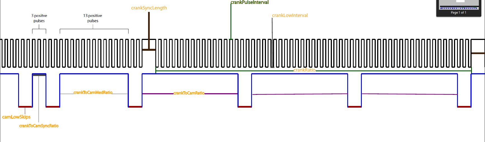

# ISX engine speed signal simulator
simulating 2 digital signals coming from cranckshaft and camshaft which are in sync with each other to facilitate the diagnostics tests on the engine control module of engine

## How It's Made:

**Tech used:** C++, NPN sensors, arduino

Engine powers 2 NPN digital engine speed sensors that move from high 5v to low 3v states.
One sensor reads the crankshaft sensor and other reads the camshaft sensor. Crankshaft has only two types of spacing for pulses, one large sync pulse and the rest are smaller pulses for calculating RPM. Camshaft has multiple pulse widths used for syncing the firing order of injectors.

Connecting arduino output pins to the signal side of the sensor can be used to bypass the sensor and pulse a high and low state the ECM will recognize.

## Optimizations
use of controller registers can speed up reaction time for high and low states leading to cleaner signal, coming from low cost arduino nanos

## Lessons Learned:
conversions from long to int datatypes added additional time to pulse spacing leading to unstable digital signals that ecm did not recognize

